# Building PCs

This website is designed to teach people who are new to PC building. It will teach the user, what each component is, why it is important, how it interacts with other components and how they all fit together.

Along side this page is personal details regarding my passion for buildings PCs and a bit about myself, what I do in my free time and how much I adore my cat.

Below is a wireframe for the concept of the website.

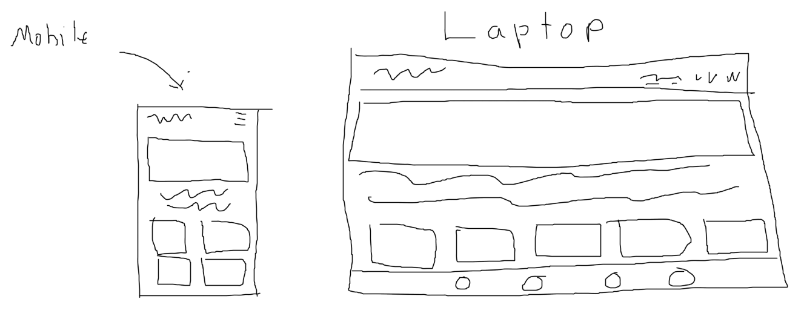

## Features

### The features in this website are as follows

The home page introduces the user to what the website is about. The first image the user sees changes depending on their device. Underneath the text are content boxes that direct the user to the page for the corresponding component. At the top of each page is a navigation bar, so the user can navigate back to either of the three pages. The bottom of the page features a footer with social media icons. They lead to a blank version of the website.

The about page gives detail to the creator of the website. Talks about their passion and interests. Below the text is a responsive gallery of the creator's cat.

The contact page has a form that emails the creator of the website regarding any questions the user might have when browsing the site.

### Existing Features

- **Navigation bar**
  - Featured on all three pages, it is fully responsive. Has a logo on smaller screens and links to the home about, and contact page. Identical on all pages for easy navigation.
  - The user can easily navigate between pages without having to use the back button to go back to the previous page.
  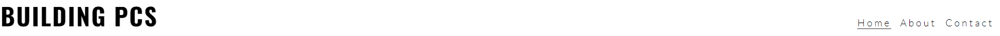
- **Home page Image**
  - The home page includes a photo that changes depending on the user device.
  - Depending on the device, the user will see a cat or desktop to show even a cat can build a PC.
  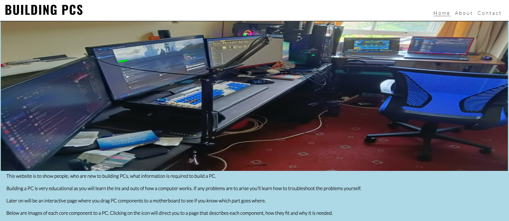
- **Component boxes**
  - The component boxes tell the user what are the core components for PC building.
  - The boxes are responsive so are distiguishable on any device. Once clicked on will direct the user to the corresponding component info page.
  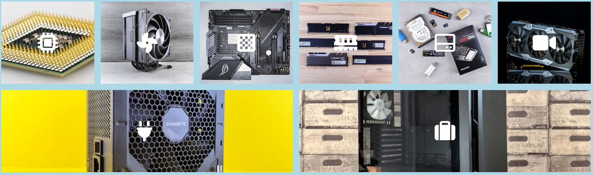
- **Footer**
  - Includes relevant social media sites for Building PCs. They open a new tab to allow for easy navigation.
  - Encourages the user to engage via social media.
  
- **About page**
  - An image the creator of the website likes that changes size and position depending on device. With a small background into the creator interests.
  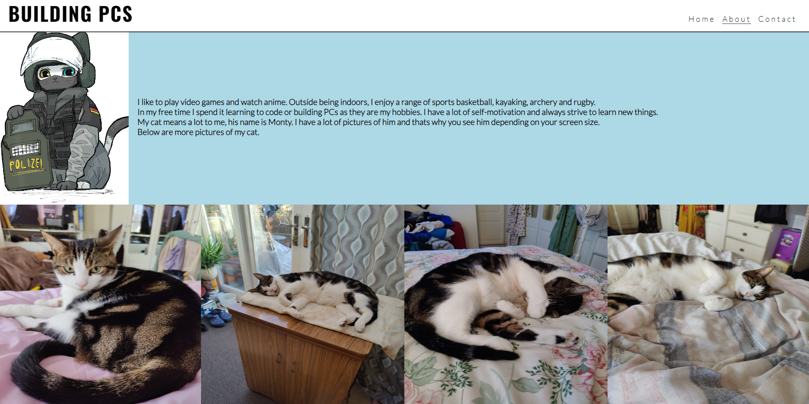
- **Pictures of cats**
  - A display of the creators cat, the display changes depending on the user device. But all show pictures of the cat.
  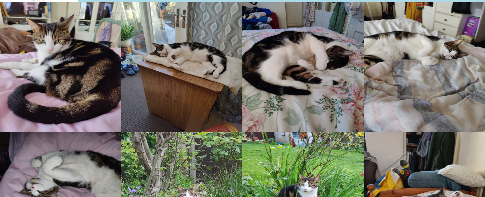
- **Contact page**
  - This page allows the user to contact the creator regarding any questions or help needed regarding building a PC. The form requires an name, email and message to able to send.
  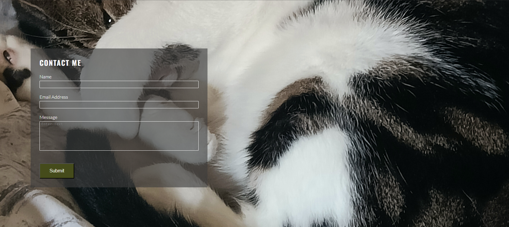

### Features Left to Implement

- Info pages to each component
- Interactive match the component game

## Testing

The testing done for the website was to check that each button, page and responsiveness work as intended. Each button on the home page, go to the intended destination i.e. clicking the about button on the nav bar directs the user to the about page. clicking the social media icons on the footer opens a new page going to the respected social site. clicking on the component boxes go to a under construction page.

The responsiveness of the page was tested to make sure the user experience on mobile was as easy as using the page on a laptop. The nav bar changes icon and is tapped to open up the other pages. The images grow and shrink depending on the screen. The images changing depending on what device the user is on.

The about page has a creator image and text describing the creator interests. It is readable and responsive as when the size of the screen gets bigger, the image is moved to the left and the text is moved to the right and centered. Below is a gallery of cats. Which change position depending on screensize. On a mobile it is in one column and can be scrolled up and down to see every picture. On a larger device it goes into 2 or 4 columns to fill up the space making more pictures visible at a time.

The contact page requires that all fields have an input making sure the user doesn't try to send a message with any missing data needed. The form moves depending on the size of the screen but still stays functional.

Accessibility of the page has it that the user can press the nav button to go back to a previous page if needed without the back button. The text has a fall back font that makes sure the website is still readable. Each image has a fall back name incase it fails to load.

The website was given to fellow peers to test each function and all have come back with no issues.

Below is an image of how the website looks on multiple devices to show off responsiveness.

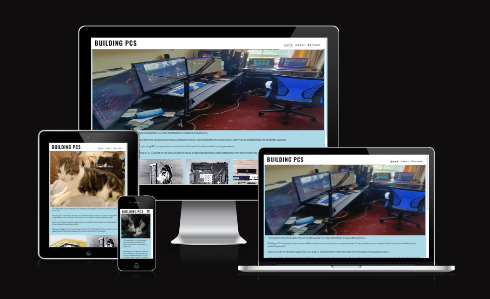

### Validator Testing

- HTML
  - No errors were returned when passing through the official [W3C Validator](https://validator.w3.org)
    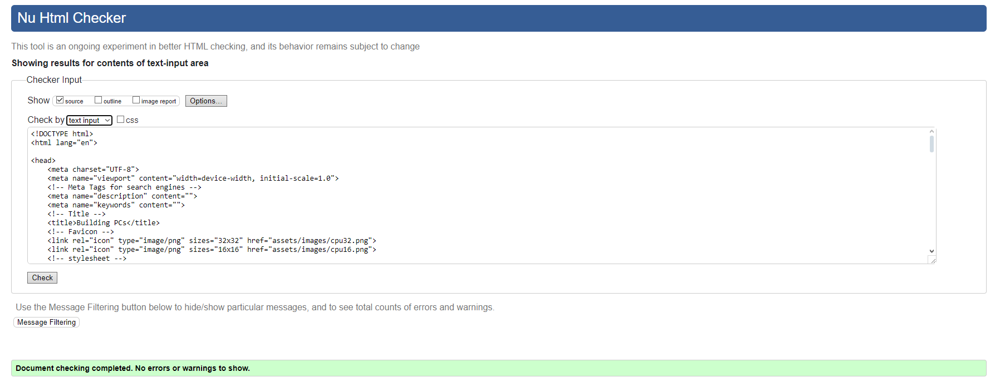

- CSS
  - No errors were returned when pass through official [W3C Validcator CSS](https://jigsaw.w3.org/css-validator/)
    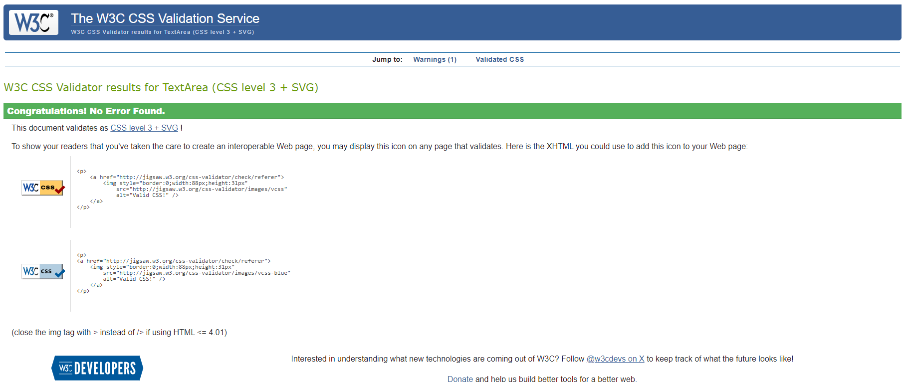

- Lighthouse
  - Overall performance of website is good
    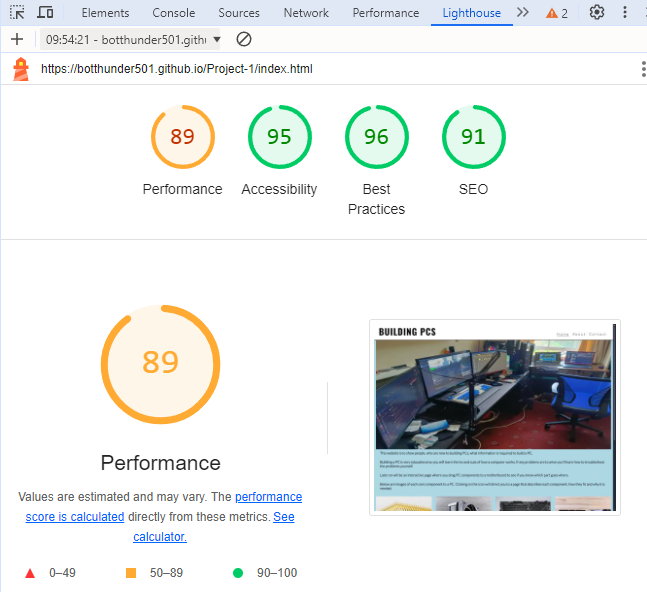

## Deployment

- GitHub pages was used to deploy the website, instructions to deploy are as follows:
  - In the GitHub repository, navigate to the settings tab
  - On the left hand side, under code and automation, click on pages
  - Source is set to "Deploy from a branch", branch should be set to "main", then press save
  - After saved, go back to the main page and refresh after some time on the right hand side a successfull deployment will show

The link for the deployed website can be found here - [Building PCs](https://botthunder501.github.io/Project-1/)

## Credits

### Content

- Instructions on how to implement Header, Footer, form and CSS was taken from [Love Running](https://github.com/Code-Institute-Solutions/love-running-v3)
- The icons used in footer and content boxes were taken from [Font Awesome](https://fontawesome.com)

### Media

- The photos used on the home, about and contact page were taken by me.
- The images used for the content boxes were taken from [pexels](https://www.pexels.com)
